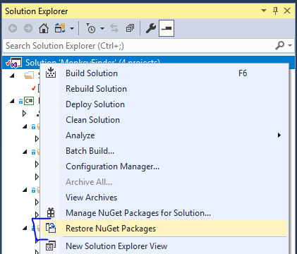
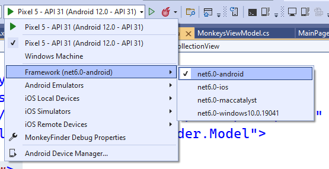

## NET MAUI - Workshop using .NET7

### Open Solution in Visual Studio

1. Open **MonkeyFinder.sln**

This MonkeyFinder contains 1 project:

* MonkeyFinder - The main .NET MAUI project that targets Android, iOS, macOS, and Windows. It includes all scaffolding for the app including Models, Views, ViewModels, and Services.

### NuGet Restore

All projects have the required NuGet packages already installed, so there will be no need to install additional packages during the Hands on Lab. The first thing that we must do is restore all of the NuGet packages from the internet.

1. **Right-click** on the **Solution** and select **Restore NuGet packages...**

### Run the App

Ensure that you have your machine setup to deploy and debug to the different platforms:

* [Android Emulator Setup](https://docs.microsoft.com/dotnet/maui/android/emulator/device-manager)
* [Windows setup for development](https://docs.microsoft.com/dotnet/maui/windows/setup)

1. In Visual Studio, set the Android or Windows app as the startup project by selecting the drop down in the debug menu and changing the `Framework`

2. In Visual Studio, click the "Debug" button or Tools -> Start Debugging
    - If you are having any trouble, see the Setup guides for your runtime platform

Running the app will result in a list of three monkeys:

